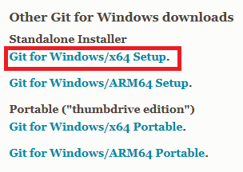

## Comandos GIT

Descargar GIT del [enlace](git-scm.com/install/windows)

Crear proyecto en GIT

        > git init 

Loguearse

        > git config --global user.name "Tu Nombre"
        > git confit --global user.mail "Tu Correo@mail.com"

Crear rama 

        > git checkout -b feature/prueba

Ver ramas

        > git branch

Cambiar rama

        > git checkout 
        > git reset --hard #commit

Instalar dependencias:

        > npm install